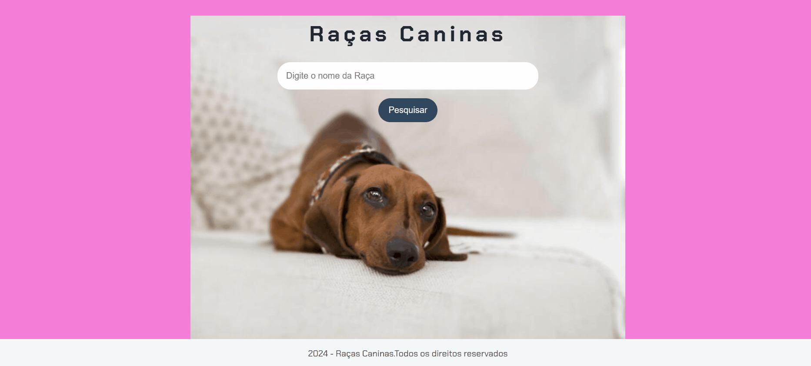

### Projeto Raças Caninas 🐶💖

## Informações
- Este projeto foi criado na semana de imersão da Alura com Google Gemini;
- O projeto é um site de busca de raças caninas, descrevendo algumas raças mais comuns;
- Pode ser útil para algum usuário que queira mais informações sobre determinada raça antes de adquirir um cachorro;

### Linguagens utilizadas
- Html;
- Css;
- JavaScript;
